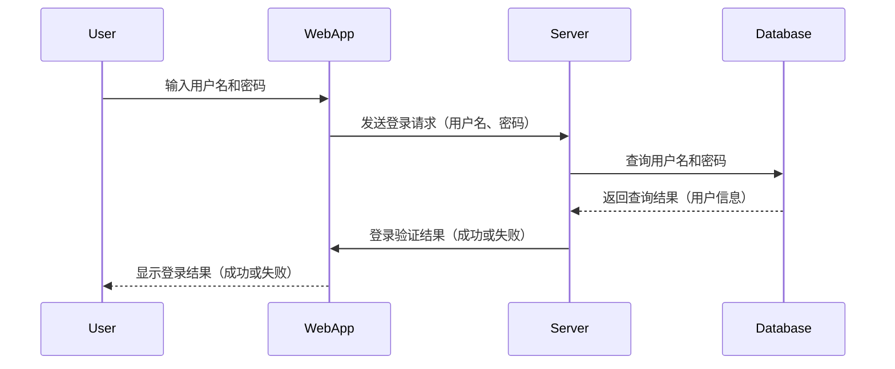
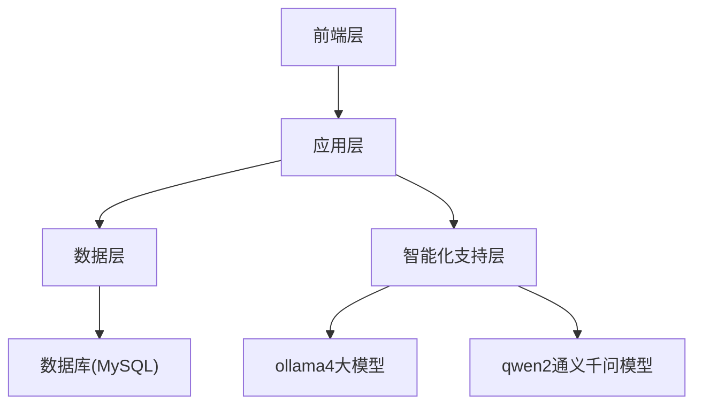
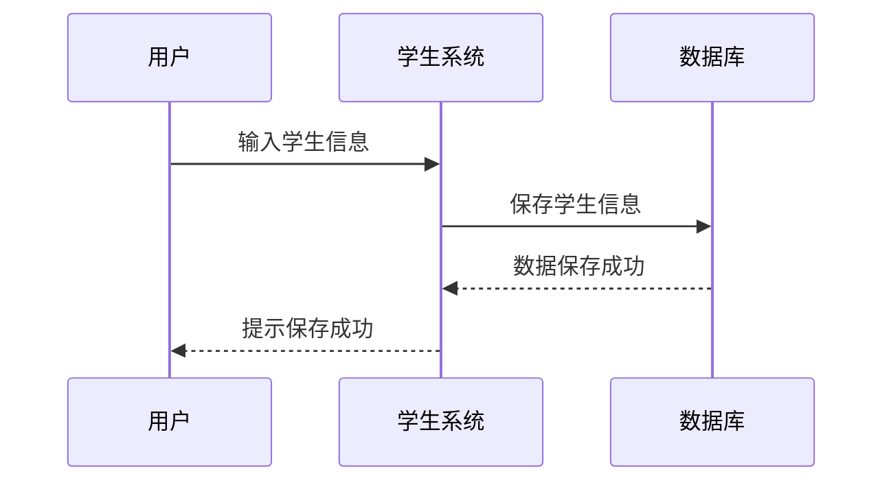
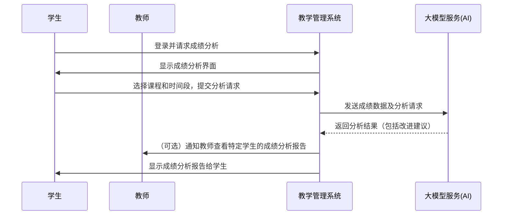
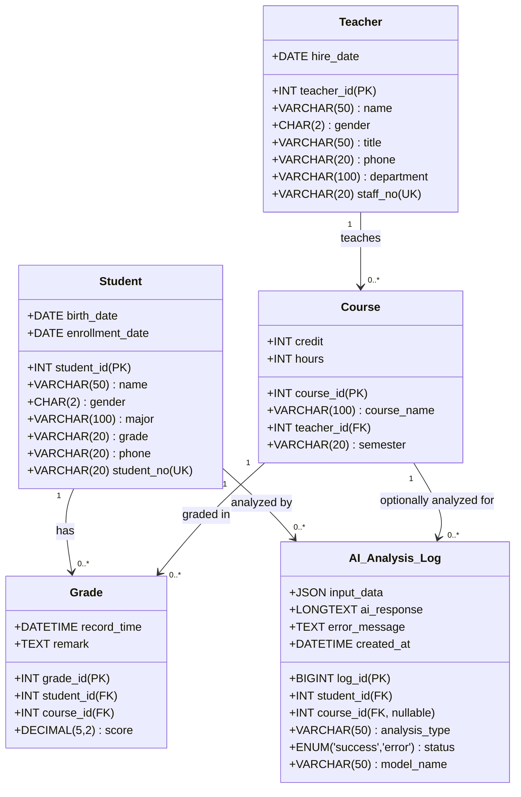

<h1 align="center" style="margin: 30px 0 30px; font-weight: bold;">HMS</h1>
<h4 align="center">基于SpringBoot+Vue前后端分离的Java快速开发框架</h4>


## 平台简介

* 前端采用Vue、Element UI。
* 后端采用Spring Boot、Spring Security、Redis & Jwt。
* 权限认证使用Jwt，支持多终端认证系统。
* 支持加载动态权限菜单，多方式轻松权限控制。
* 高效率开发，使用代码生成器可以一键生成前后端代码。

## 演示环境
- PC端服务演示地址：http://82.156.236.247/login?redirect=/index
- 移动端H5演示地址：http://82.156.236.247:9090/login?redirect=/index#/
- 移动端APP下载地址：https://gitee.com/sillage_c/health-management-system/releases/download/app_v1.1.3/T1%E5%A4%A7%E5%81%A5%E5%BA%B7_v1.1.3.apk

## 用户
| 用户名    | 密码     | 角色    |
|--------|--------|-------|
| YHC    | 123456 | 系统管理员 |
| user01 | user01 | 普通用户  |

## 内置功能

1.  用户管理：用户是系统操作者，该功能主要完成系统用户配置。
2.  部门管理：配置系统组织机构（公司、部门、小组），树结构展现支持数据权限。
3.  岗位管理：配置系统用户所属担任职务。
4.  菜单管理：配置系统菜单，操作权限，按钮权限标识等。
5.  角色管理：角色菜单权限分配、设置角色按机构进行数据范围权限划分。
6.  字典管理：对系统中经常使用的一些较为固定的数据进行维护。
7.  参数管理：对系统动态配置常用参数。
8.  通知公告：系统通知公告信息发布维护。
9.  操作日志：系统正常操作日志记录和查询；系统异常信息日志记录和查询。
10. 登录日志：系统登录日志记录查询包含登录异常。
11. 在线用户：当前系统中活跃用户状态监控。
12. 定时任务：在线（添加、修改、删除)任务调度包含执行结果日志。
13. 代码生成：前后端代码的生成（java、html、xml、sql）支持CRUD下载 。
14. 系统接口：根据业务代码自动生成相关的api接口文档。
15. 服务监控：监视当前系统CPU、内存、磁盘、堆栈等相关信息。
16. 缓存监控：对系统的缓存信息查询，命令统计等。
17. 在线构建器：拖动表单元素生成相应的HTML代码。
18. 连接池监视：监视当前系统数据库连接池状态，可进行分析SQL找出系统性能瓶颈。


## 时序图




系统总体架构分为多个层次，包括访问层、编程语言层、服务层、数据层、存储层和基础设施层。

- **访问层**：包括ToC和ToB的用户访问，分别通过WEB和PC端进行。
- **编程语言层**：WEB端使用Uniapp、Node、Vue，PC端使用Vue、Java。
- **服务层**：包含系统管理、数据池、业务服务、鉴权服务和系统监控等模块。
- **数据层**：负责数据缓存、存储过程、事务和消息管道的管理。
- **存储层**：使用Cache和Redis进行缓存，使用MySQL作为数据库。
- **基础设施层**：基于Linux和Windows操作系统，使用Docker进行容器化部署，并集成ollama中间件。

- **系统管理**：包括组织管理、用户管理、字典管理和菜单管理。
- **数据池**：包括学生建档、教师建档、课程建档和教学资料库。
- **业务服务**：包括资料检索、消息推送、专属大模型和成绩录入。
- **鉴权服务**：负责用户权限的管理和验证。
- **系统监控**：负责系统的日志记录和监控。


```plaintext
+---------------------+
|    用户前端界面     |
+---------------------+
           |
           v
+---------------------+
|      后端服务       |  <---> 数据库
|  (Spring Boot)      |
+---------------------+
           |
           v
+---------------------+
|   第三方服务模块   |
|  (AI处理, API调用) |
+---------------------+
```



### 成绩分析时序图



