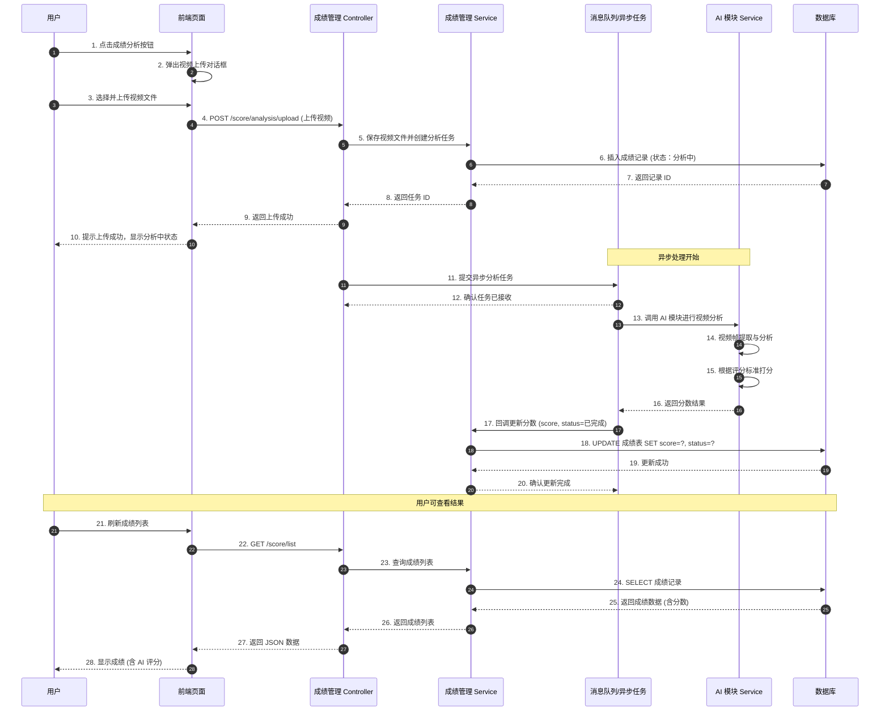

# 成绩管理 - 视频 AI 分析功能开发方案

## 功能概述

用户在成绩管理节点中，通过上传视频文件，系统异步调用 AI 模块进行智能打分，并将分数写入成绩管理模块。

## 时序图



## 接口设计

### 1. 视频上传接口

```
POST /score/analysis/upload
Content-Type: multipart/form-data

参数:
- file: 视频文件 (MultipartFile)
- studentId: 学生 ID (Long)
- analysisType: 分析类型 (String)

返回:
{
  "code": 200,
  "msg": "上传成功，正在分析中",
  "data": {
    "taskId": "UUID",
    "recordId": 123456
  }
}
```

### 2. 查询分析任务状态接口

```
GET /score/analysis/status/{taskId}

返回:
{
  "code": 200,
  "msg": "操作成功",
  "data": {
    "taskId": "UUID",
    "status": "PROCESSING | COMPLETED | FAILED",
    "score": 95.5,
    "feedback": "动作标准，节奏良好"
  }
}
```

### 3. AI 模块调用接口 (内部)

```
POST /ai/video/analyze
Content-Type: application/json

参数:
{
  "videoPath": "视频文件路径",
  "analysisType": "分析类型",
  "callbackUrl": "回调地址"
}

返回:
{
  "score": 95.5,
  "details": {
    "accuracy": 90,
    "completeness": 95,
    "timing": 98
  },
  "feedback": "详细评语"
}
```

## 数据库设计

### 建表语句

```sql
-- ----------------------------
-- 成绩分析记录表
-- ----------------------------
drop table if exists hms_score_record;
create table hms_score_record (
  id                int(11)         not null auto_increment    comment '主键 ID',
  course_id         int(11)         not null                   comment '课程 ID',
  student_id        int(11)         not null                   comment '学生 ID',
  file_path         varchar(500)    default ''                 comment '文件路径',
  file_name         varchar(255)    default ''                 comment '文件原始名称',
  file_size         int(11)         default 0                  comment '文件大小 (字节)',
  analysis_type     varchar(50)     default ''                 comment '分析类型',
  score             decimal(5,2)    default null               comment 'AI 评分',
  status            char(1)         default '0'                comment '分析状态（0 待分析 1 分析中 2 已完成 3 分析失败）',
  feedback          text            default null               comment 'AI 评语',
  analysis_details  varchar(2000)   default null               comment '分析详情',
  task_id           varchar(64)     default ''                 comment '异步任务 ID',
  create_by         varchar(64)     default ''                 comment '创建者',
  create_time       datetime                                   comment '创建时间',
  update_by         varchar(64)     default ''                 comment '更新者',
  update_time       datetime                                   comment '更新时间',
  remark            varchar(500)    default null               comment '备注',
  del_flag          char(1)         default '0'                comment '删除标志（0 代表存在 2 代表删除）',
  primary key (id)
) engine=innodb auto_increment=1 comment = '成绩分析记录表';
```

### 字段说明

| 字段名 | 类型 | 说明 |
|--------|------|------|
| id | int(11) | 主键 ID，自增 |
| course_id | int(11) | 课程 ID |
| student_id | int(11) | 学生 ID |
| file_path | varchar(500) | 文件存储路径 |
| file_name | varchar(255) | 文件原始名称 |
| file_size | int(11) | 文件大小（字节） |
| analysis_type | varchar(50) | 分析类型（如：跑步、跳远等） |
| score | decimal(5,2) | AI 评分，保留 2 位小数 |
| status | char(1) | 分析状态：0-待分析，1-分析中，2-已完成，3-分析失败 |
| feedback | text | AI 给出的文字评语 |
| analysis_details | varchar(2000) | 分析详情，JSON 格式存储各项细分得分 |
| task_id | varchar(64) | 异步任务 ID，用于查询任务状态 |
| create_by | varchar(64) | 创建者 |
| create_time | datetime | 创建时间 |
| update_by | varchar(64) | 更新者 |
| update_time | datetime | 更新时间 |
| remark | varchar(500) | 备注 |
| del_flag | char(1) | 删除标志（0 代表存在 2 代表删除） |

## 技术要点

1. **文件上传**: 支持大视频文件上传，配置合适的文件大小限制
2. **异步处理**: 使用 Spring @Async 或消息队列进行异步任务处理
3. **AI 集成**: 调用已有的 AI 模块进行视频分析打分
4. **状态管理**: 记录分析任务状态，支持前端轮询查询
5. **错误处理**: 分析失败时的错误处理和重试机制

## 开发任务

- [ ] 创建成绩记录实体类和 Mapper
- [ ] 实现视频上传接口
- [ ] 实现异步任务处理逻辑
- [ ] 集成 AI 模块调用
- [ ] 实现任务状态查询接口
- [ ] 前端页面开发 (上传组件、状态展示)
- [ ] 单元测试编写
