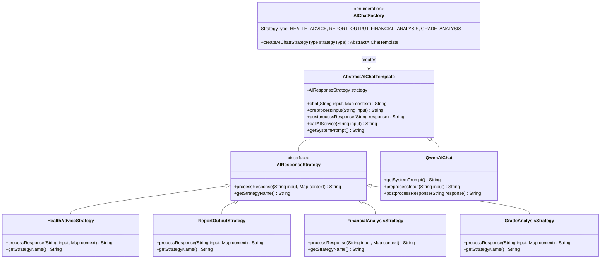

# AI对话系统类图

## 类图说明

此设计结合了策略模式、模板方法模式和工厂模式：

- **策略模式**: `AIResponseStrategy` 接口及其实现类，用于处理不同场景的响应逻辑（如健康建议、报表输出、财务分析、成绩分析等）
- **模板方法模式**: `AbstractAIChatTemplate` 抽象类定义了AI对话的基本流程，包含AI连接等通用配置，具体的AI实现类可自定义预处理和后处理逻辑
- **工厂模式**: `AIChatFactory` 用于创建不同策略类型的AI对话实例

## 类图结构

## 设计模式说明

### 策略模式 (Strategy Pattern)
- `AIResponseStrategy` 是策略接口
- `HealthAdviceStrategy`、`ReportOutputStrategy`、`FinancialAnalysisStrategy`、`GradeAnalysisStrategy` 是具体策略实现
- 每个策略类对应不同场景，有其独特的提示词和处理逻辑
- 所有策略都使用Qwen作为唯一服务源

### 模板方法模式 (Template Method Pattern)
- `AbstractAIChatTemplate` 定义了AI对话的通用算法骨架
- 包含AI连接等通用配置处理（API URL、密钥、模型等）
- `chat()` 方法是模板方法，定义了对话的通用流程
- `preprocessInput()`、`postprocessResponse()` 和 `getSystemPrompt()` 是抽象方法，由子类实现特定逻辑
- `callAIService()` 是通用方法，处理AI服务调用逻辑
- `QwenAIChat` 是具体实现类

### 工厂模式 (Factory Pattern)
- `AIChatFactory` 负责创建不同策略类型的AI对话实例
- 通过 `StrategyType` 枚举来区分不同的策略类型（健康建议、报表输出、财务分析、成绩分析）
- 客户端通过工厂获取实例，无需关心具体实现细节

### 设计优势
- 统一使用Qwen作为服务源
- AI连接等通用配置集中在抽象类中，便于维护
- 通过策略模式支持不同场景（健康建议、报表输出、财务分析、成绩分析等）
- 保持了模板方法模式和工厂模式的优势
- 高度可扩展，可以轻松添加新的策略类型